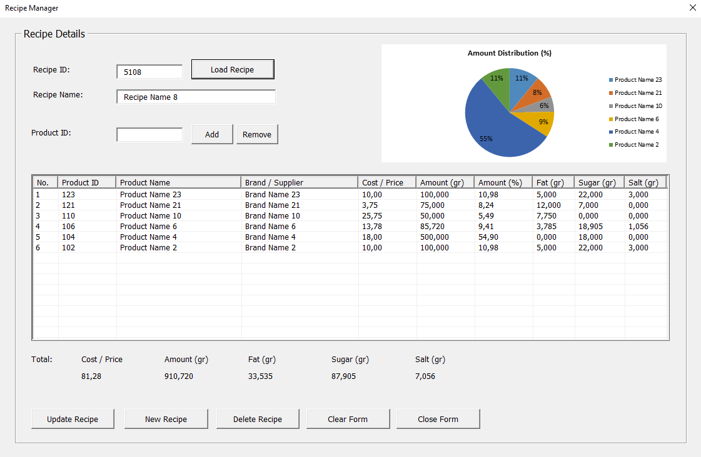

# ERP-like Recipe & Cost Management System  

## 🔍 Overview  

**ERP-like system** that automates the complete recipe lifecycle — from ingredient registration to cost and nutrition aggregation — with built-in data validation, referential integrity, and recovery automation.  

Designed for food industry professionals, it demonstrates **relational data logic**, **automated reporting**, and **centralized UX integration** through a custom Ribbon interface.  

  

---

## 🧱 Core Architecture  

| Layer | Component | Description |
|-------|------------|-------------|
| **Data Layer** | Ingredient Manager | Automates CRUD operations with real-time validation and numeric checks |
| **Logic Layer** | Recipe Manager | Handles recipe CRUD, cost/nutrition aggregation, and automated chart visualization |
| **File Layer** | Recipe File Manager | Dynamic file browser with sorting, validation, and one-click open/recovery automation |
| **Integrity Layer** | Protection & Recovery | Ensures referential and file-level integrity with automatic recreation of missing recipe files |
| **Interface Layer** | Ribbon Controller | Centralized control of all user forms, enabling modeless interaction |
| **Validation Layer** | Numeric Validation Module | Locale-aware input checks enforcing consistent formatting across systems |

---

## ✨ Key Features  

- **Relational Data Management:** Maintains bidirectional integrity between ingredients and recipes  
- **Automated Recipe Book Generator:** Creates standardized Excel recipe files with embedded charts  
- **Dynamic Visualization:** Auto-generated pie charts showing ingredient composition and proportions  
- **Smart Validation:** Numeric, duplication, and mandatory-field checks with locale awareness  
- **Self-Healing Logic:** Automatic recovery and regeneration of deleted or missing recipe files  
- **Custom Ribbon Interface:** Streamlined access to all core modules and recovery utilities  
- **Secure Architecture:** Workbook protection, controlled unprotect/reprotect routines, and version consistency  

---

## 📈 Business & Technical Value  

- Implements **ERP-style relational automation** fully within Excel-VBA  
- Demonstrates **data consistency, structured automation, and file-level synchronization**  
- Showcases **software engineering discipline** within Excel’s constrained environment  
- Technically relevant for **Data Engineering** and **Automation Engineering** roles  
- Modular design adaptable to **Python** or **C#** environments for enterprise-scale systems  

---

## ▶️ Run the System  

Download the ready-to-run package:  
📦 [Recipe_Management_System.zip](./Recipe_Management_System.zip)

1. Unzip the file to any local folder.  
2. Open **`Recipe Management System.xlsm`**.  
3. Use the **Custom Data Tools** tab to access all modules:  
   - **Product Manager** – manage and validate ingredients  
   - **Recipe Manager** – create, edit, and visualize recipes
   - **Recipe Book** – browse, sort, and open saved recipe files with one click
   - **Info Panel** – built-in user guide describing system modules and usage steps

The system runs fully offline and requires no external dependencies.

